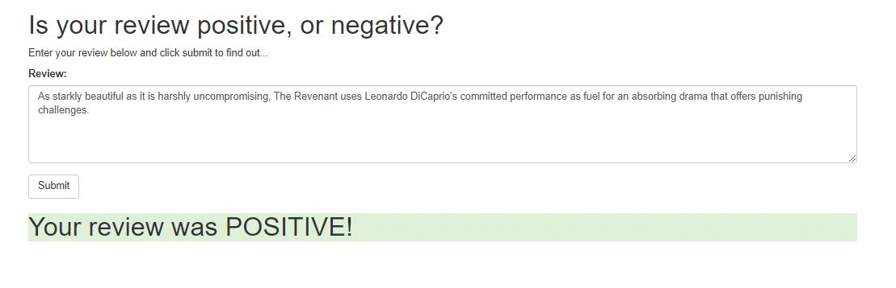

# neuralnetwork-sentiment-analysis
## A Sentiment Analysis Web App using PyTorch and AWS SageMaker

**Basic webapp link**: https://tensorgit.github.io/tensorgit-sentiment.github.io/
(The App won't work as long as the AWS endpoint is deactivated)

**Preview**

**Description:**
- A simple app that returns the sentiment of a movie review using a neural network with a single hidden layer trained using PyTorch on the IMDb dataset: http://ai.stanford.edu/~amaas/data/sentiment/ 
- The webapp is trained using AWS SageMaker services, deployed using AWS Lambda function and API Gateway
